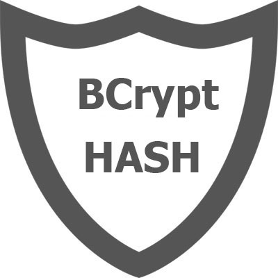
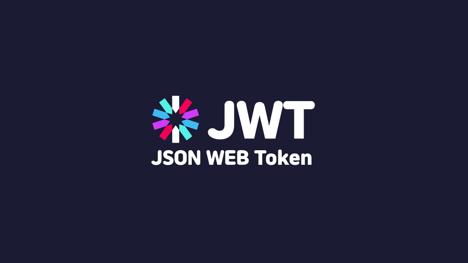

[link](https://folksoul-api.nika-nozadze.redberryinternship.ge)
## Folksoul API

Folksoul-Api is Rest Api to create or get information about folksoul band

### Table of Contents
* [Prerequisites](#Prerequisites)
* [Tech Stack](#Tech-Stack)
* [Getting Started](#Getting-Started)
* [Project Structure](#Project-Structure)

#
### Prerequisites

*  *Node JS @16.X and up*
*  *Typescript @4 and up*
*  *npm @8 and up*

#
### Tech Stack

*  *body-parser @ 1.20.0 - Node.js body parsing middleware*
*  *bcrypt @ 5.0.1 - A library to hash passwords*
*  *dotenv @ 16.0.1 - zero-dependency module that loads environment variables from a .env file*
*  *express @ 4.18.1 - web framework for node*
*  *joi @ 17.6.0 - schema description language and data validator for JavaScript*
*  *jsonwebtoken @ 8.5.1 - An implementation of JSON Web Tokens*
*  *mongodb @ 4.7.0 - document database*
*  *mongoose @ 6.4.4 - MongoDB object modeling tool*
*  *prompt @ 1.3.0 - command-line prompt for node.js*
*  *swagger @ 4.4.0 - module provides tools for designing and building Swagger-compliant APIs entirely in Node.js*
*  *yaml @ 0.3.0 - yaml is a definitive library for YAML, the human friendly data serialization standard*

#
### Getting Started
1. First of all you need to clone app repository from github:
```
git clone https://github.com/RedberryInternship/folksoul-api-nikanoza.git
```
2. Next step requires install all the dependencies.

```
npm install
```
3. Also you need to create .env file where copy information from .env.example file

```
cp .env.example .env
```
4. To create your own database, need to create new local connection, host would be localhost.
also you need to replace variables values in .env file, or you can generate mongo atlas url with user and password

5. Also you need to generate your own jwt secret string for protect routes authentication and save it on .env file

6. To create new user need npm command in terminal

```
npm run create:user
```

#
### Project Structure

```
|--- src
|   |--- config # configuration files
|   |---|--- mongo.js # perform mongoDb connection 
|   |---|--- swagger.yaml # swagger configuration file 
|   |--- controllers # functions for routes
|   |--- middlewares # extra helper middleware functions
|   |---|--- auth-middleware.js # function to protect some routes 
|   |---|--- swagger-middleware.js # function to build and serve swagger
|   |--- models # mongoose models for mongoDb
|   |--- routes # project routes 
|   |--- schemas # Joi validation schema files
|   |--- scripts # custom npm commands files
|   |--- server.js # main file
- .eslintrc.json  # eslint config file
- .prettierrc.json  # prettier config file
- tsconfig.json # typescript configuration
- package.json # dependency manager configurations
```


